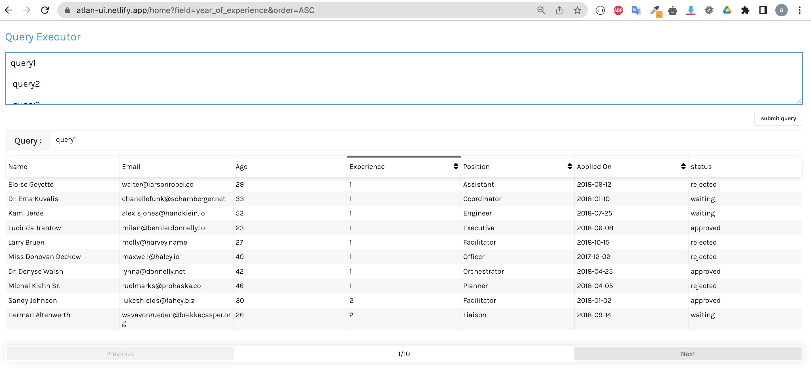

# Hiring UI DATA

## Installation

```bash
 Node v12
```

### Dependency Installation

```bash
npm i
```

### Running Local Dev Server

```bash
npm run start
```

### unit Test cases

###### unit test cases are added only 2 files but i can add for other files as well

```bash
npm run unit
```

### unit test cases with sonar coverage

you have to start local sonar sever that can download from

```bash
https://www.sonarqube.org/downloads/
{directory where sonar in installed}./sonar.sh console


example -
./Downloads/sonarqube-6.7.7/bin/macosx-universal-64/sonar.sh console
```

OR follow

[https://techblost.com/how-to-setup-sonarqube-locally-on-mac/](https://techblost.com/how-to-setup-sonarqube-locally-on-mac/)

```bash
brew services start sonarqube
```

then we can run below command

```bash
npm run test:sonar-local
```

### if wanted to see coverage without sonar

run below command and open `index.html` in browser inside `tests/coverage/icov-report/index.html`

```bash
npm run test:report
```

### github repo

- https://github.com/anand-tiwari/atlan

### Backend Server

- As a backend server i am using `json-server` deployed in heroku
- [Backend](https://faker-server.herokuapp.com/sql)

### Performance review, i prefer lighthouse

- [lighthouse-devtools](https://web.dev/performance-scoring/?utm_source=lighthouse&utm_medium=devtools)

## Tech

- [Vue.js](https://v3.vuejs.org/) - HTML enhanced for web apps!
- [Vuex](https://vuex.vuejs.org/) - state management
- [webpack](https://webpack.js.org/) - module bundler
- [Babel](https://babeljs.io/) - javascript compiler
- [Vue-test-Utils](https://vue-test-utils.vuejs.org/) - for vue component testing
- [Jest](https://jestjs.io/) - testing framework
- [node.js](https://nodejs.org/en/) - evened I/O for the backend

## How to Run.

Open [Homescreen](https://atlan-ui.netlify.app/)


Select query from textarea and click on submit query button to get result
we can get more query from [Backend](https://faker-server.herokuapp.com/sql)


Result page


No Result page


We can Apply sorting on field containing sorting icon.


we can Apply sorting on any pages and result get sorted and we will be on same page instead of starting from page 1


Table in scrollable horizontal


Query TextArea :
textarea resize button is disabled.
we have configuration of min(4) & max(15) rows for textarea if we crossed more than 15 rows we will get scrollbar in textarea.

## Documentation

This project contains all other setup like

```bash
https apis call,
api request/response setup
proxy configuration to avoid CROS error
router
vuex store
responsive scss
```

it won't require any setup level changes we just have to mention backend api path and start with staging mode
Let's see each of modules.

## src

src module contains all the source code

## api

if we need to have any backend api call we have mentioned define a method for that api
and we can use that method inside action(vuex store)

## assets

it contains scss and images that we have to use in code.

## components

it contains all .vue components

## config

this is place to define

    static text
    backend api path
    that we are going to use in project

## pages

it contains all the landing pages.
TabsPage (route - `http://localhost:10010/` ) to display Plugin Manager UI Home page

## router

for configuring all the route and corresponding vue component to render.

## store & plugins

this is place to define store modules and plugins and attach them with vuex

## main.js & App.vue

Start of the project. vue app creation

## .env

```bash
.env.{mode}
```

mode - development, production, staging

to configure some property based on environment

## vue.config.js

to override or configure vuejs webpack configuration

## build

contains dockerization and release build related code.

    config.js
    ----------
    to proxy backend api from localhost to avoid CROS error

    index.js
    --------
    to run production build code in localhost environment
    if we wanted to check how our build works we can use this to run code in local to see.
    [ npm run build ] - (it will create build)
    [ npm run preview ] - (it will run build code in local server)

## License

MIT
